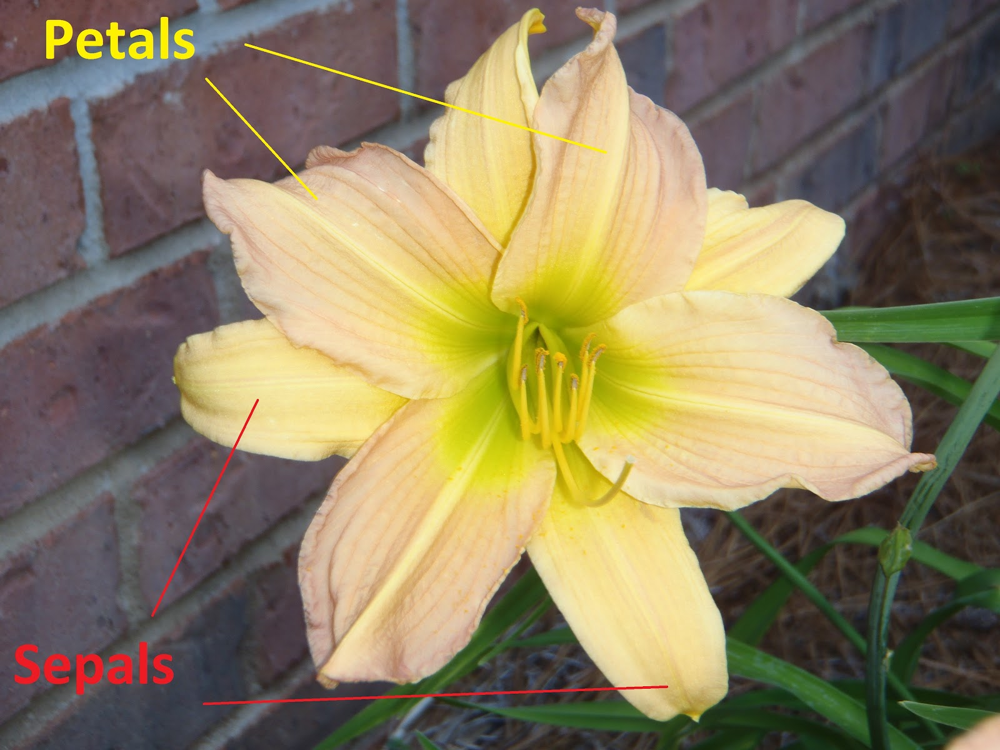

<style>
h1{font-weight: 400;}
</style>

```{r setup, include=FALSE}
knitr::opts_chunk$set(echo=TRUE, message=FALSE, warning=FALSE, eval=FALSE, fig.width=16/2, fig.height=9/2)
library(tidyverse)
```


***


# Tuesday, July 23 2019

## Gentle Introduction to Kaggle Competitions

**Example**: The following code will take you through your first Kaggle competition submission: [House Prices: Advanced Regression Techniques](https://www.kaggle.com/c/house-prices-advanced-regression-techniques){target="_blank"}.

```{r, eval = TRUE}
library(tidyverse)

# 1. Load in training and test data
train <- read_csv("https://rudeboybert.github.io/SDS293/static/train.csv")
test <- read_csv("https://rudeboybert.github.io/SDS293/static/test.csv")
sample_submission <- read_csv("https://rudeboybert.github.io/SDS293/static/sample_submission.csv")


# 2.a) Exploratory data analysis! EDA! Look at your data!
# View(train)
# View(test)
# View(sample_submission)

# 2.b) Compute a single predicted value for all houses: the mean sale price of 
# all houses in training set
y_hat_1 <- mean(train$SalePrice)
y_hat_1


# 3.a) Exploratory data analysis! EDA! Visualizations
# Distribution of numerical outcome variable
ggplot(train, aes(x = SalePrice)) +
  geom_histogram() +
  labs(x = "Sale price in dollars") +
  geom_vline(xintercept = y_hat_1, col="red")

# 3.b) Distribution of numerical outcome variable on a log10-scale
ggplot(train, aes(x = SalePrice)) +
  geom_histogram() +
  scale_x_log10()  +
  labs(x = "Sale price in dollars (log10-scale)")


# 4. Apply fitted model to get predictions for test data. Note format of
# submission data frame must match sample_submission.
submission <- test %>%
  select(Id) %>%
  mutate(SalePrice = y_hat_1)

# Look at your data!
# View(submission)

# 5. Output predictions to CSV for submission to Kaggle
write_csv(submission, "submission.csv")
```


**Exercise**: You will now make a submission to Kaggle using a linear regression model. Do the following:

1. Perform an exploratory data analysis of the variable and its relationship with `SalePrice`.
1. Make a Kaggle submission.

Hint: Here is code that will allow you to fit a linear regression model to a training set and then apply it to the test set to get predictions

```{r, eval = TRUE}
# Split mtcars data frame into two parts
mtcars_train <- mtcars %>% 
  slice(1:16)
mtcars_test <- mtcars %>% 
  slice(17:32)

# 1) Fit regression model to training data
model_2 <- lm(mpg ~ hp, data = mtcars_train)

# 2) Get predictions for test data. Note:
# - The output here is a vector
# - We'll see later on that there is more than one way to get predictions from a fitted model
y_hat_2 <- predict(model_2, newdata = mtcars_test)
```

**Solutions**: 

```{r, eval = TRUE}

```


## Iris dataset

The `iris` dataset is a canonical dataset in statistics and machine learning ([Wikipedia](https://en.wikipedia.org/wiki/Iris_flower_data_set)). Introduced by Fisher in his 1936 paper "The use of multiple measurements in taxonomic problems as an example of linear discriminant analysis." For 150 iris flowers it has 5 variables.

As categorical outcome variable $y$ one of three species of iris flower:

Setosa            |  Versicolor |  Virginica
:-------------------------:|:-------------------------:|:-------------------------:
  |    |  

Four numerical predictor variables $\vec{x}$: Sepal length, sepal width, petal length, and petal width, all in cm.

<center></center>

</br>

**Exercise**: We'll now visually build a model to predict `Species` using two predictor variables `Sepal.Length` and `Sepal.Width`

1. Preprocess the `iris` data and perform an EDA. 
1. Based on the final visualization, try to create a model for predicting `Species` by partioning the cartesian plane with lines i.e. cutting it up into pieces.
1. If you have time, repeat this exercise using `Petal.Length` and `Petal.Width`

```{r, eval = TRUE}
library(tidyverse)
iris <- iris %>%
  # Convert to "tibble" tidy data frame:
  as_tibble() %>% 
  # Add identification variable to uniquely identify each row.
  rownames_to_column(var="ID") 

# EDA! Look at your data! Understand your data!
?iris
# View(iris)

# EDA! Visualization of relationship between outcome variable Species and
# two numerical predictors: sepal length and width
ggplot(iris, aes(x=Sepal.Length, y = Sepal.Width, col = Species)) +
  geom_point() +
  labs(x = "x1: Sepal Length", y = "x2: Sepal Width", col = "y: Species")

# This plot suffers from "overplotting", so let's "jitter" the plot: give each
# point a random "nudge" to break ties. Note this is stricly a visualization
# tool; the original iris data does not change.
ggplot(iris, aes(x=Sepal.Length, y = Sepal.Width, col = Species)) +
  geom_jitter() +
  labs(x = "x1: Sepal Length", y = "x2: Sepal Width", col = "y: Species")
```


## Classification and Regression Trees

**Example**: The following code create a visualization of a fitted CART model

```{r, eval=TRUE}
# Package for fitting CART.
library(rpart)

# Fit CART model to entire iris data set
model_CART_1 <- rpart(Species ~ Sepal.Length + Sepal.Width, data = iris)

# Visualize tree
plot(model_CART_1, margin=0.25)
text(model_CART_1, use.n = TRUE)
title("Predicting iris species using sepal length & width")
box()

# Playing with different complexity parameters. Try: cp = 0, 0.2, and 0.5. What
# does the tree look like in each case.
model_CART_1 <- rpart(Species ~ Sepal.Length + Sepal.Width, data = iris,
                      control = rpart.control(cp = 0.2))
plot(model_CART_1, margin=0.25)
text(model_CART_1, use.n = TRUE)
title("Predicting iris species using sepal length & width")
box()
```

How does this CART model translate to our EDA from above?

```{r, echo = FALSE, eval = TRUE, fig.width=6.5}
# Figure.
region_labels <- tibble(
  Sepal.Length = c(4.5, 4.5, 7, 5.95, 5.7),
  Sepal.Width = c(4.4, 2.1, 4.4, 4.4, 2.1),
  label = c("Leaf 1", "Leaf 2", "Leaf 5", "Leaf 3", "Leaf 4")
)

iris %>%
  ggplot(aes(x=Sepal.Length, y = Sepal.Width)) +
  geom_jitter(aes(col = Species)) +
  labs(x = "x1: Sepal Length", y = "x2: Sepal Width", col = "y: Species") +
  annotate("segment", x = 5.45, xend = 5.45, y = 2, yend = 4.5, size = 1) +
  annotate("segment", x = 4, xend = 5.45, y = 2.8, yend = 2.8, size = 1) +
  annotate("segment", x = 6.15, xend = 6.15, y = 2, yend = 4.5, size = 1) +
  annotate("segment", x = 6.15, xend = 5.45, y = 3.1, yend = 3.1, size = 1) +
  geom_text(data = region_labels, aes(label = label), size = 10) +
  labs(x = "x1: Sepal Length", y = "x2: Sepal Width",
       title = "Jittered scatterplot of CART", col = "y: Species")
```


**Example**: The following code shows you how to fit a CART model to training data and apply the fitted model to test data to obtain predictions

```{r, eval=FALSE}
# 1. Randomly split the iris dataset into two parts: train and test. We first set 
# the random number generator seed value for replicable randomness and use the
# dplyr package anti_join() function to ensure train and test do not share rows
# in common.
set.seed(76)
iris_train <- iris %>%
  sample_frac(0.5)
iris_test <- iris %>%
  anti_join(iris_train, by = "ID")

# 2.a) Fit CART model to training
model_CART_2 <- rpart(Species ~ Sepal.Length + Sepal.Width, data = iris_train)

# 2.b) Visualize fitted tree. It is different than the previous tree fit to all
# the iris data
plot(model_CART_2, margin = 0.25)
text(model_CART_2, use.n = TRUE)
title("Predicting iris species using sepal length & width")
box()

# 3. Add predictions on test set to iris_test
iris_test <- iris_test %>% 
  mutate(Species_hat = predict(model_CART_2, type="class", newdata = iris_test))
# View(iris_test)
```


**Exercise**: Make a submission to the [House Prices: Advanced Regression Techniques](https://www.kaggle.com/c/house-prices-advanced-regression-techniques){target="_blank"} competition by fitting a CART model. Note set `type="vector"` in the `predict()` because we are now dealing with a numerical outcome variable.

```{r, eval=FALSE}
library(skimr)
skim(train)

# 2.a) Fit CART model to training
model_CART_3 <- rpart(SalePrice ~ GrLivArea + HalfBath + YearBuilt, data = train,
                      control = rpart.control(cp = 0)
                      )

# 2.b) Visualize fitted tree. It is different than the previous tree fit to all
# the iris data
plot(model_CART_3, margin = 0.25)
text(model_CART_3, use.n = TRUE)
title("Predicting sale price")
box()

# Make predictions
submission_3 <- test %>%
  select(Id) %>%
  mutate(SalePrice = predict(model_CART_3, type="vector", newdata = test))

# Write to CSV
write_csv(submission_3, "submission_3.csv")
```


***


# Wednesday, July 24 2019

## RMSLE

Root Mean Squared Error (RMSE) vs Root Mean Squared Logarithmic Error (RMSLE):

{ width=500px }

For more on log and log10 transformations, see:

* [moderndive](https://moderndive.com/A-appendixA.html#appendix-log10-transformations){target="_blank"} for a discussion on orders of magnitude.
* Wacky [Powers of Ten](https://www.youtube.com/watch?v=0fKBhvDjuy0){target="_blank"} movie by Charles and Ray Eames.


## CART Shiny App

Go over the `CART.Rmd` Shiny App file in this RStudio Project folder. It delves deeper into the role of the "complexity parameter" `cp` in CART.


## Demonstration of overfitting

**Example**: Recall the model I showed at the end of Tuesday: a CART model with complexity `cp = 0` (i.e. maximal complexity) which got a Kaggle score of 0.21878. We'll now show that `cp = 0` leads to CART models that are wayyyyy overfit. We'll do this by fitting a CART model to `train` and also evaluating the CART model's performance via the RMSLE on `train`. In other words, you'll fit and evaluate the model *using the same data*. 

```{r, eval=FALSE}
library(tidyverse)
library(rpart)
# For ggpairs() function below:
library(GGally)

# Reload house prices data
train <- read_csv("https://rudeboybert.github.io/SDS293/static/train.csv")
test <- read_csv("https://rudeboybert.github.io/SDS293/static/test.csv")

# First: EDA visulization of all pairwise relationships between numerical
# variables:
train %>% 
  select(SalePrice, GrLivArea, HalfBath, YearBuilt) %>% 
  ggpairs()

# Fit CART model to training. Note the cp = 0
model_CART_3 <- rpart(SalePrice ~ GrLivArea + HalfBath + YearBuilt, 
                      data = train, 
                      control = rpart.control(cp = 0.2))

# Visualize fitted tree! Lots of complexity!!
plot(model_CART_3, margin = 0.25)
text(model_CART_3, use.n = TRUE)
title("Very complex CART model for sale price")
box()

# Apply the model to get predictions on the training data, not the test data.
# In other words, we are fitting our model AND evaluating the performance of the
# model on the same data.
y_hat_3 <- predict(model_CART_3, type="vector", newdata = train)

# Compute the RMSLE using dplyr data wrangling. Write your resulting RMSLE down
# on a piece of paper. Note while we explicitly compute the RMSLE here, in the 
# future you'll use built-in functions.
train %>% 
  mutate(
    # Add variable of predicted sale prices:
    SalePrice_hat = y_hat_3,
    # Add variable of logarithmic error for each house (i.e. each row):
    le = log(SalePrice + 1) - log(SalePrice_hat + 1),
    # Add variable of squared logarithmic error for each house (i.e. each row):
    sle = le^2
    ) %>% 
  # Summarize the rows by computing the mean squared logarithmic error:
  summarize(msle = mean(sle)) %>% 
  # Add variable of root mean squared logarithmic error:
  mutate(rmsle = sqrt(msle))
```

**Exercise**: Now, instead of fitting and evaluating the model using the same `train` data as above, you'll now fit and evaluate the model using *different* data. You'll do this by articifically creating two separate data sets by randomly splitting `train` into two: `train_validation` and `test_validation`. This is the *validation set* approach; think of this as your first building blocks towards cross-validation.

```{r, eval=FALSE}
# Randomly split the train dataset into two parts: train_validation and
# test_validation. We first set the random number generator seed value for
# replicable randomness and use the dplyr package anti_join() function to ensure
# train and test do not share rows in common.
set.seed(76)
train_validation <- train %>%
  sample_frac(0.5)
test_validation <- train %>%
  anti_join(train_validation, by = "Id")

# Fit the above complex CART model to train_validation:
# Fit CART model to training. Note the cp = 0
model_CART_4 <- rpart(SalePrice ~ GrLivArea + HalfBath + YearBuilt, 
                      data = train_validation, 
                      control = rpart.control(cp = 0.2))

# Make predictions on test_validation and compute the RMSLE:
y_hat_4 <- predict(model_CART_4, type="vector", newdata = test_validation)

# Compute the RMSLE using dplyr data wrangling. Write your resulting RMSLE down
# on a piece of paper. Note while we explicitly compute the RMSLE here, in the 
# future you'll use built-in functions.
test_validation %>% 
  mutate(
    # Add variable of predicted sale prices:
    SalePrice_hat = y_hat_4,
    # Add variable of logarithmic error for each house (i.e. each row):
    le = log(SalePrice + 1) - log(SalePrice_hat + 1),
    # Add variable of squared logarithmic error for each house (i.e. each row):
    sle = le^2
    ) %>% 
  # Summarize the rows by computing the mean squared logarithmic error:
  summarize(msle = mean(sle)) %>% 
  # Add variable of root mean squared logarithmic error:
  mutate(rmsle = sqrt(msle))
```

Questions:

1. Compare your two RMSLE scores. Which one is bigger? The RMSLE when you fit/evaluate the model on the *same* data? Or the RMSLE when you fit/evaluate the model on *different* data?
1. Which of these two RMSLE scores is closer to the actual RMSLE score returned by Kaggle of 0.21878.

**Bonus**: Repeat the above comparison for a value of the complexity parameter `cp` other than 0. In other words, a value of `cp` that will yield a less complex tree, as quantified by the number of leaves it has. 


## Cross-validation

In this exercise, we'll code up a 5-fold crossvalidation algorithm from scratch. Note that while we are doing this from scratch here, once you get the idea behind cross-validation, in the future you'll use built-in functions.

Specifically, we'll get an *estimate* of the RMSLE on new independent data for a CART model with complexity parameter `cp = 0` i.e. maximal complexity. 

We start by randomly assigning each row in `train` to a fold (there are many other ways we could do this too):

```{r, eval=TRUE}
train <- train %>% 
  # This dplyr function will sample a fraction "size" of the rows at random.
  # Thus by setting size = 1 = 100%, we are effectively randomly reordering the 
  # rows.
  sample_frac(size = 1) %>% 
  # Assign fold values 1:5 for each row:
  mutate(fold = rep(1:5, length = n())) %>% 
  arrange(fold)

# Count the fold variable:
train %>% 
  count(fold)

# For each fold, we'll save the estimated RMSLE of the predictions here:
RMSLE_per_fold <- rep(0, length = 5)
RMSLE_per_fold
```

Let's now perform cross-validation on the first fold only:

```{r, eval = TRUE}
# This package has a built-in rmlse() function
library(Metrics)

# Set the cross-validation training set to be folds 2-5
train_cv <- train %>% 
  filter(fold != 1)
# Set the cross-validation test set to be fold 1
test_cv <- train %>% 
  filter(fold == 1)

# Fit CART model on train_cv
CART_cv <- rpart(SalePrice ~ GrLivArea + HalfBath + YearBuilt, 
                    data = train_cv, 
                    control = rpart.control(cp = 0))

# Make predictions on test_cv
y_hat_cv <- predict(CART_cv, type = "vector", newdata = test_cv)

# Compute the RMSLE of predictions for the first fold and save
RMSLE_per_fold[1] <- rmsle(test_cv$SalePrice, y_hat_cv)
RMSLE_per_fold
```

**Exercise**: Here is an example of a `for` loop in R:

```{r, eval=FALSE}
for(i in 1:10){
  print(i)
}
```

Using the `for` loop code above, perform model fitting/predicting on all 5 folds and then compute the overall estimated RMSLE for `cp = 0`:

```{r, eval=FALSE}

```

**Bonus**: Modify the above code so that you hardcode the number of folds `k` once (`k <- 5` for example) and have the rest of the code adjust accordingly. 

```{r, eval = TRUE}
# Bonus:

```


## Picking "optimal" complexity

**Example**: Let's now compute the estimated RMSLE using the three values of the complexity parameter `cp` I played around with yesterday: 0, 0.2, 0.5. Do this by manually changing the `cp` value in the solutions to the above cross-validation exercise. 

Question: Of these three values of `cp`, which one is "optimal"?

```{r, eval=FALSE}
k <- 5

# Randomly set k folds
train <- train %>% 
  sample_frac(size = 1) %>% 
  mutate(fold = rep(1:k, length = n())) %>% 
  arrange(fold)

# Perform cross-validation on all 5 folds:
for(i in 1:k){
  # Set the cross-validation training set to be folds 2-5
  train_cv <- train %>% 
    filter(fold != i)
  # Set the cross-validation test set to be fold 1
  test_cv <- train %>% 
    filter(fold == i)
  
  # Fit CART model on train_cv
  CART_cv <- rpart(SalePrice ~ GrLivArea + HalfBath + YearBuilt, 
                   data = train_cv, 
                   control = rpart.control(cp = 0))
  
  # Make predictions on test_cv
  y_hat_cv <- predict(CART_cv, type = "vector", newdata = test_cv)
  
  # Compute the RMSLE of predictions for the first fold and save
  RMSLE_per_fold[i] <- rmsle(test_cv$SalePrice, y_hat_cv) 
}

# Compute overall estimate RMSLE
RMSLE_per_fold
mean(RMSLE_per_fold)
```

**Exercise**: 

1. Using a second outer `for` loop, evaluate the estimated RMLSE for a large number of complexity parameter values `cp`, instead of just the three from above. 
1. Plot a scatterplot with `cp` on the x-axis and estimated RMLSE on the y-axis. Visually pick which `cp` value you think is optimal.
1. Use this optimal `cp` to make a Kaggle submission.

```{r, eval=FALSE}

# Estimate RMSLE for a large number of cp values:
cp_values <- seq(from = 0, to = 0.003, len = 101)
RMLSE_per_cp_value <- rep(0, times = length(cp_values))

for(j in 1:length(cp_values)){
  cp_to_evaluate <- cp_values[j]
  # Perform cross-validation on all 5 folds:
  for(i in 1:k){
    # Set the cross-validation training set to be folds 2-5
    train_cv <- train %>% 
      filter(fold != i)
    # Set the cross-validation test set to be fold 1
    test_cv <- train %>% 
      filter(fold == i)
    
    # Fit CART model on train_cv
    CART_cv <- rpart(SalePrice ~ GrLivArea + HalfBath + YearBuilt, 
                     data = train_cv, 
                     control = rpart.control(cp = cp_to_evaluate))
    
    # Make predictions on test_cv
    y_hat_cv <- predict(CART_cv, type = "vector", newdata = test_cv)
    
    # Compute the RMSLE of predictions for the first fold and save
    RMSLE_per_fold[i] <- rmsle(test_cv$SalePrice, y_hat_cv) 
  }
  # Save RMLSE for this particular cp value
  RMLSE_per_cp_value[j] <- mean(RMSLE_per_fold)
}

# Create data frame of cp_values and corresponding estimates of RMLSE:
results <- tibble(
  cp_value = cp_values,
  RMLSE = RMLSE_per_cp_value
)

# Plot RMSLE as a function of cp:
ggplot(results, aes(x = cp_value, y = RMLSE)) +
  geom_point() +
  geom_line() +
  labs(x = "Complexity parameter", y = "Estimated RMSLE")

# Find cp_star corresponding to lowest RMLSE
results %>% 
  arrange(RMLSE)

# Using optimal complexity parameter cp*, make a submission to Kaggle:
cp_star <- 0.00045

# a) Fit CART model to ALL training data
model_CART_5 <- rpart(SalePrice ~ GrLivArea + HalfBath + YearBuilt, data = train,
                      control = rpart.control(cp = cp_star)
                      )

# 2.b) Visualize fitted tree. It is different than the previous tree fit to all
# the iris data
plot(model_CART_5, margin = 0.25)
text(model_CART_5, use.n = TRUE)
title("Predicting sale price using optimal cp")
box()

# Make predictions on test data:
submission_5 <- test %>%
  select(Id) %>%
  mutate(SalePrice = predict(model_CART_5, type="vector", newdata = test))


```


## Review of Multiple Linear Regression

Go over the `regression.Rmd` Shiny App in this RStudio Project folder. It is a refresher of Multiple Linear Regression using the `Credit` card debt dataset from the `ISLR` package from the  "An Introduction to Statistical Learning with Applications in R" textbook available as a free PDF [here](http://faculty.marshall.usc.edu/gareth-james/ISL/){target="_blank"}.


***


# Thursday, July 25 2019

## LASSO regularization

Go over the `LASSO.Rmd` Shiny App file in this RStudio Project folder. It introduces the ideas behind the LASSO, in particular the same idea of a "complexity parameter" that balances between "model fit" and "model complexity". 

**Exercise**: The code below runs LASSO. Modify it to make a Kaggle submission in the [House Prices: Advanced Regression Techniques](https://www.kaggle.com/c/house-prices-advanced-regression-techniques){target="_blank"} competition.

```{r, eval = TRUE}
library(tidyverse)
library(glmnet)
library(broom)
library(modelr)
library(ISLR)

# 1. Create training and test data
set.seed(76)

# Clean up original Credit data from ISLR package
credit <- Credit %>%
  as_tibble() %>%
  select(Balance, Income, Limit, Rating, Cards, Age, Education, Married) %>% 
  rownames_to_column(var="ID")

# Create training set
credit_train <- credit %>%
  sample_frac(0.5)

# Create test set
credit_test <- credit %>%
  anti_join(credit_train, by = "ID") %>%
  # Remove outcome variable to make a Kaggle competition-like test set
  select(-Balance)


# 2. Define model formula and create corresponding model matrices ----
model_formula <-
  "Balance ~ Income + Limit + Rating + Cards + Age + Education + Married" %>%
  as.formula()

y_train <- credit_train$Balance
x_matrix_train <- credit_train %>%
  model_matrix(model_formula, data = .) %>%
  select(-`(Intercept)`) %>%
  as.matrix()

x_matrix_test <- credit_test %>%
  # Since model_formula has the outcome variable Balance in it, model_matrix()
  # needs this variable to create the model matrix. Since credit_test doesn't
  # have it, we simply create dummy outcome variable to get around this issue:
  mutate(Balance = 1) %>%
  model_matrix(model_formula, data = .) %>%
  select(-`(Intercept)`) %>%
  as.matrix()


# 3. For given search grid of lambdas, plot LASSO trajectory. Note:
# - While this plot is quick to create, IMO it's not as informative
# - The x-axis is not lambda in log-scale, rather log(lambda)
# - The numbers correspond to columns in x_matrix_train
lambda_inputs <- 10^seq(from = -5, to = 3, length = 100)
LASSO_fit_train <- glmnet(
  x = x_matrix_train, 
  y = y_train, 
  alpha = 1, 
  lambda = lambda_inputs
)
plot(LASSO_fit_train, xvar = "lambda", label = TRUE)


# 4. For same search grid of lambdas, plot CV results. Note:
# - While this plot is quick to create, IMO it's not as informative
# - The x-axis is not lambda in log-scale, rather log(lambda)
LASSO_CV <- cv.glmnet(
  x = x_matrix_train,
  y = y_train,
  alpha = 1,
  lambda = lambda_inputs,
  nfolds = 10,
  type.measure = "mse"
)
plot(LASSO_CV)

# Extract optimal lambda complexity parameter
lambda_min <- LASSO_CV$lambda.min
log(lambda_min)


# 5. Get beta-hats coefficients corresponding to model fit to training data using optimal lambda
coef(LASSO_CV, s = "lambda.min")


# 6. Get predictions corresponding to model fit to training data using optimal lambda
predict(LASSO_CV, newx = x_matrix_test, s = "lambda.min") %>% 
  as.vector()
```

Example Kaggle submission:

```{r, eval=FALSE}

```


***


# Friday, July 26 2019

## Random Forests

Here we use the `caret` package as a wrapper to the `randomForest` package's `randomForest()` function. The beauty of `caret` is you can switch in a lot of different modeling methods easily; see a list of models [here](http://topepo.github.io/caret/available-models.html){target="_blank"}.

```{r, eval=FALSE}
library(tidyverse)
library(caret)
library(randomForest)

# Reload house prices data:
train <- read_csv("https://rudeboybert.github.io/SDS293/static/train.csv")
test <- read_csv("https://rudeboybert.github.io/SDS293/static/test.csv")

# Transform outcome variable space:
train <- train %>% 
  mutate(logSalePrice = log(SalePrice + 1))
model_formula <-
  "logSalePrice ~ BldgType + CentralAir + Fireplaces + GrLivArea + YearBuilt + SaleCondition + FullBath" %>%
  as.formula()

# Specify 10-fold CV
fit_control <- trainControl(method = "cv", number = 10)

# Number of randomly chosen variables to split on at each node of tree
mtry <- 2:4
tunegrid <- expand.grid(.mtry=mtry)

# Fit model
set.seed(76)
model_rf <- caret::train(
  model_formula, 
  data = train, 
  # Set method to random forests:
  method = "rf",
  metric = "RMSE",
  trControl = fit_control,
  tuneGrid = tunegrid
  )
model_rf

# Make predictions in transformed space:
logSalePrice_hat <- predict(model_rf, test)
logSalePrice_hat

# Return predictions to original space by undoing transformation:
SalePrice_hat <- exp(logSalePrice_hat) - 1
SalePrice_hat

# Submit to Kaggle:
submission_rf <- test %>%
  select(Id) %>%
  mutate(SalePrice = SalePrice_hat)
write_csv(submission_rf, "submission_rf.csv")
```


## Bias-Variance Trade-off

Recall the following slide from the presentation on Tuesday:

<center>
{ width=500px }
</center>

Why does the orange curve (the model error when you fit a model to training but evaluate it's prediction performance on new independent test data) have that U-shape? Because of the "bias-variance" trade-off. 

$$
\mbox{MSE}\left[\widehat{f}(x)\right] = \mbox{Var}\left[\widehat{f}(x)\right] +
\left(\mbox{Bias}\left[\widehat{f}(x)\right]\right)^2 + \sigma^2
$$

where $\widehat{y} = \widehat{f}(x)$ and $y=f(x)+\epsilon$ with $\mathbb{E}\left[\epsilon\right] = 0$ and $\mbox{Var}[\epsilon] = \sigma$. For more info, read this [blog post](http://scott.fortmann-roe.com/docs/BiasVariance.html){target="_blank"}.


